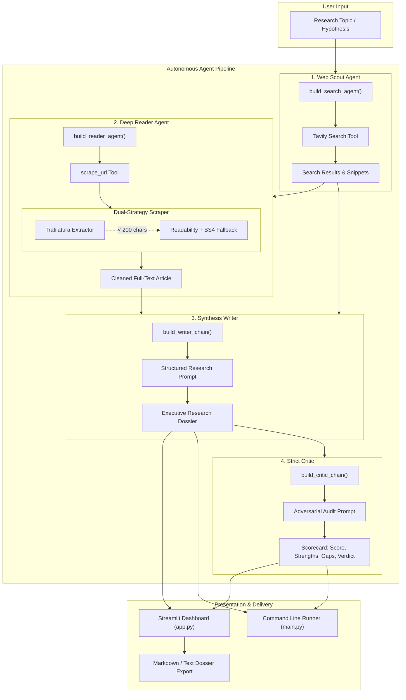

# ⚡ Multi-Agent Autonomous Research & Intelligence System

<div align="center">

[](https://www.python.org/)
[](https://python.langchain.com/)
[](https://aistudio.google.com/)
[](https://tavily.com/)
[](https://streamlit.io/)
[](LICENSE)
[](CONTRIBUTING.md)

<p align="center">
  <b>An enterprise-grade, autonomous multi-agent research pipeline that crawls the live web, extracts deep primary source intelligence, synthesizes structured executive dossiers, and subjects them to rigorous adversarial peer review.</b>
</p>

[Key Features](#-key-features) •
[System Architecture](#-system-architecture) •
[Quickstart](#-quickstart) •
[Web Dashboard](#-web-dashboard) •
[CLI & Programmatic Usage](#-cli--programmatic-usage) •
[Configuration](#-configuration) •
[Roadmap](#-roadmap)

</div>

---

## 📌 Overview

Traditional single-prompt LLM research suffers from knowledge cutoffs, hallucinated references, and superficial generalizations. 

**Multi-Agent Research System** solves this by decomposing the end-to-end analytical workflow into four distinct, specialized agents orchestrated via **LangChain**, backed by **Google Gemini** reasoning and **Tavily AI Search**:

1. **Web Scout Agent**: Discovers high-authority, real-time web sources and snippets.
2. **Deep Reader Agent**: Intelligently selects the highest-signal target URL and extracts full-text primary articles using dual-strategy scraping (`Trafilatura` + `Readability`).
3. **Synthesis Writer Agent**: Synthesizes cross-source telemetry into an executive dossier with key findings and verified sources.
4. **Strict Critic Agent**: Adversarially evaluates the dossier against academic standards, producing a quantitative scorecard (Score /10, Strengths, Areas to Improve, Verdict).

The project includes both a **high-end Obsidian & Amber dark-mode Streamlit web app** and a **headless Python pipeline** for scripts and automated workflows.

---

## 🚀 Key Features

- **🤖 4-Tier Autonomous Agent Fleet**: Coordinated pipeline with clear division of labor, state handoffs, and tool execution.
- **🌐 Real-Time Live Web Intelligence**: Integrated with Tavily Search API for zero-day information retrieval beyond LLM training cutoffs.
- **🛡️ Resilient Dual-Strategy Web Extraction**: Primary extraction via `Trafilatura` with automatic fallback to `readability-lxml` and `BeautifulSoup4` to bypass boilerplates and dynamic layouts.
- **⚖️ Adversarial Peer-Review & Rigor Scorecard**: Built-in independent critic chain that grades reports on factual accuracy, citations, and analytical depth.
- **💎 High-End Streamlit Web Application**:
  - Live 4-stage pipeline execution stepper with real-time progress callbacks.
  - Interactive telemetry inspection (Search Telemetry, Article Payload, Writer Inputs).
  - Domain-badged source cards with direct external links.
  - One-click exports to **Markdown (`.md`)** and **Plain Text (`.txt`)**.
  - Local session history to review past runs without re-executing.
- **⚡ Flexible LLM Support**: Optimized for Google Gemini (`gemini-3.5-flash-lite`, `gemini-1.5-pro`, `gemini-2.0-flash`) via `langchain-google-genai`.
- **💻 CLI & Script Ready**: Direct programmatic execution via `run_research_pipeline()` for batch automation.

---

## 🏗️ System Architecture



---

## 📂 Project Structure

```bash
Multi_Agent_Research_System_Using_Langchain-/
├── .env.example             # Configuration template for API keys & model selection
├── .gitignore               # Ignored environments, cache files, and credentials
├── LICENSE                  # Apache 2.0 Open Source License
├── README.md                # Comprehensive documentation
├── app.py                   # High-end Streamlit web dashboard & interactive runner
├── main.py                  # CLI entrypoint for headless pipeline execution
├── requirements.txt         # Project dependencies
└── src/
    ├── __init__.py
    ├── agents/
    │   ├── __init__.py
    │   └── agent.py         # Agent builders (Search, Reader, Writer, Critic) & LLM factory
    ├── pipelines/
    │   ├── __init__.py
    │   └── pipeline.py      # Core pipeline orchestration, telemetry parsing & callbacks
    └── tools/
        ├── __init__.py
        └── tools.py         # Tavily web search and resilient scraping tools
```

---

## ⚙️ Prerequisites

Before running the system, make sure you have:

- **Python 3.10+** (Python 3.11 recommended)
- **Google Gemini API Key**: Obtain a free key from [Google AI Studio](https://aistudio.google.com/)
- **Tavily Search API Key**: Obtain a free key (1,000 monthly searches) from [Tavily AI](https://tavily.com/)

---

## 🛠️ Quickstart

### 1. Clone the Repository

```bash
git clone https://github.com/Aditya5250/Multi_Agent_Research_System_Using_Langchain-.git
cd Multi_Agent_Research_System_Using_Langchain-
```

### 2. Set Up a Virtual Environment

**Using Conda (Recommended):**
```bash
conda create -n langagent python=3.11 -y
conda activate langagent
```

**Using venv:**
```bash
python -m venv venv

# On Linux/macOS:
source venv/bin/activate

# On Windows (PowerShell):
.\venv\Scripts\Activate.ps1
```

### 3. Install Dependencies

```bash
pip install --upgrade pip
pip install -r requirements.txt
```

### 4. Configure Environment Variables

Copy the `.env.example` template to `.env` and fill in your API credentials:

```bash
cp .env.example .env
```

Edit `.env`:
```env
GEMINI_API_KEY="your-gemini-api-key-here"
TAVILY_API_KEY="your-tavily-api-key-here"
GEMINI_MODEL="models/gemini-3.5-flash-lite"
```

---

## 🖥️ Web Dashboard

Launch the Streamlit web application:

```bash
streamlit run app.py
```

The interactive dashboard opens in your browser at `http://localhost:8501`.

### Dashboard Features

| Feature | Description |
| :--- | :--- |
| **System Health** | Live connectivity check for Gemini and Tavily API keys in the sidebar. |
| **Live Stepper** | Visual progress tracking across all 4 agents in real time. |
| **Executive Dossier** | Comprehensive report formatted with findings, takeaways, and verified sources. |
| **Critic Scorecard** | Visual rating (X/10), bulleted strengths, identified blind spots, and peer-review verdict. |
| **Agent Trace** | Raw telemetry inspector displaying exact payloads exchanged between pipeline stages. |
| **Sources & Citations** | Filtered, unique URLs discovered by the scout with domain badges and direct navigation links. |
| **One-Click Export** | Download the completed report as `.md` or `.txt`. |
| **Session Archive** | Revisit past reports from the sidebar without needing to rerun the pipeline. |

---

## 💻 CLI & Programmatic Usage

### Running via CLI

For a quick test or headless execution:

```bash
python main.py
```

You can customize the topic inside [`main.py`](file:///c:/Multi_Agent_Research_System_Using_Langchain-/main.py):

```python
from src.pipelines.pipeline import run_research_pipeline

topic = "Quantum Computing Milestones in 2026: Commercialization and Fault Tolerance"
result = run_research_pipeline(topic)

print("\n--- FINAL REPORT ---")
print(result["report"])

print("\n--- CRITIC REVIEW ---")
print(result["feedback"])
```

### Programmatic Integration in Your Code

```python
from src.agents.agent import get_llm
from src.pipelines.pipeline import run_research_pipeline

# Initialize customized LLM
llm = get_llm(model_name="models/gemini-3.5-flash-lite")

# Define step callback for logging or UI updates
def on_step_update(step_id, status, payload):
    print(f"[{step_id.upper()}] Status: {status}")

# Execute pipeline
state = run_research_pipeline(
    topic="Advancements in Perovskite-Silicon Tandem Solar Cells",
    step_callback=on_step_update,
    model=llm
)

# Access all pipeline artifacts
dossier = state["report"]
critic_review = state["feedback"]
search_data = state["search_result"]
scraped_data = state["scraped_content"]
```

---

## 🧠 Detailed Agent Pipeline Breakdown

### 1. Web Scout Agent (`build_search_agent`)
- **Engine**: LangChain Agent with tool calling (`create_agent`)
- **Tool**: [`web_search`](file:///c:/Multi_Agent_Research_System_Using_Langchain-/src/tools/tools.py#L18-L32) via Tavily API
- **Mechanism**: Issues queries tuned for fresh, high-authority technical content. Extracts titles, destination URLs, and 300-character descriptive snippets.
- **Output**: Multi-source consolidated intelligence digest.

### 2. Deep Reader Agent (`build_reader_agent`)
- **Engine**: LangChain Agent with tool calling (`create_agent`)
- **Tool**: [`scrape_url`](file:///c:/Multi_Agent_Research_System_Using_Langchain-/src/tools/tools.py#L36-L120)
- **Mechanism**: Evaluates the scout's results, selects the primary high-signal URL, and executes a dual-layer extraction:
  - **Strategy 1 (`Trafilatura`)**: Fast article and body extraction, filtering out navigation bars, adverts, and comments.
  - **Strategy 2 (`Readability-lxml` + `BeautifulSoup4`)**: Fallback parser if Strategy 1 yields insufficient content (< 200 characters).
- **Resilience**: Enforces realistic browser headers, 15-second timeouts, whitespace normalization, and content truncation limits (5,000 characters).

### 3. Synthesis Writer Chain (`build_writer_chain`)
- **Engine**: LangChain LCEL Chain (`writer_prompt | llm | StrOutputParser()`)
- **Mechanism**: Merges scouted search results and scraped deep-text into an executive dossier following a strict structure:
  - **Introduction**: Context and scope of research
  - **Key Findings**: Minimum 3 thoroughly explained technical pillars
  - **Conclusion**: Strategic summary and future outlook
  - **Sources**: Full list of referenced URLs

### 4. Strict Critic Chain (`build_critic_chain`)
- **Engine**: LangChain LCEL Chain (`critic_prompt | llm | StrOutputParser()`)
- **Mechanism**: Acts as a harsh peer reviewer. Audits the report for factual integrity, completeness, and unsupported assertions.
- **Format**:
  ```text
  Score: 8.5/10
  Strengths:
  - Comprehensive technical depth on cathode material innovations...
  - Verified primary sources cited...
  Areas to improve:
  - Could expand on thermal degradation risks under ultra-fast charging...
  One Line Verdict: A robust, authoritative report that covers key commercialization challenges well.
  ```

---

## 🔧 Configuration

The system is configured via environment variables in `.env`:

| Variable | Required | Default | Description |
| :--- | :---: | :---: | :--- |
| `GEMINI_API_KEY` | **Yes** | — | Google Gemini API key from AI Studio. |
| `TAVILY_API_KEY` | **Yes** | — | Tavily Search API key for web exploration. |
| `GEMINI_MODEL` | No | `models/gemini-3.5-flash-lite` | Gemini model variant (`gemini-1.5-pro`, `gemini-2.0-flash`, `models/gemini-3.5-flash-lite`). |

---

## 🗺️ Roadmap

- [ ] **LangGraph Orchestration**: Transition sequential pipeline to a stateful cyclic LangGraph graph.
- [ ] **Adversarial Rewrite Loop**: Automatically feed the Critic's feedback back into the Writer agent if `Score < 8/10` for self-correcting drafts.
- [ ] **Multi-URL Deep Scraping**: Allow parallel asynchronous scraping of multiple sources simultaneously.
- [ ] **PDF & Word Export**: Add native PDF generation with embedded formatting and charts.
- [ ] **Pluggable Search Engines**: Support alternative backends (DuckDuckGo, SearXNG, Perplexity).
- [ ] **Multi-Model Support**: Support OpenAI (GPT-4o), Anthropic (Claude 3.5), and local models via Ollama.

---

## 🤝 Contributing

Contributions are welcome! Please follow these steps:

1. **Fork the Repository**
2. **Create a Feature Branch**:
   ```bash
   git checkout -b feature/amazing-feature
   ```
3. **Commit your changes**:
   ```bash
   git commit -m "feat: add iterative critic rewrite loop"
   ```
4. **Push to the branch**:
   ```bash
   git push origin feature/amazing-feature
   ```
5. **Open a Pull Request**

Please ensure your code conforms to PEP 8 standards and includes appropriate docstrings and comments.

---

## 📄 License

Distributed under the **Apache License 2.0**. See [`LICENSE`](LICENSE) for complete details.

---

## 🙏 Acknowledgments

- [LangChain](https://github.com/langchain-ai/langchain) for agent abstractions and prompt management.
- [Google AI Studio & Gemini](https://ai.google.dev/) for multimodal reasoning and rapid inference.
- [Tavily](https://tavily.com/) for search APIs optimized for LLM agent exploration.
- [Trafilatura](https://github.com/adbar/trafilatura) for web text scraping.
- [Streamlit](https://streamlit.io/) for Python web application tooling.

<div align="center">
  <sub>Built with ❤️ by <a href="https://github.com/Aditya5250">Aditya Raj</a> & Contributors</sub>
</div>
